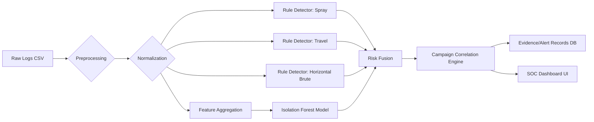

# Executive Summary  
**SprayTrace** is a rapid-development cybersecurity project to detect covert attack campaigns (especially password spray and lateral moves) across authentication logs. It combines *rule-based detectors* and an *Isolation Forest anomaly model* to flag suspicious login patterns, then *fuses* and *correlates* detections into explainable “campaigns” for SOC analysts.  The MVP (Option 2) focuses on a polished local demo: upload or generate login CSVs → pipeline (normalization → detectors → ML → correlation) → dashboard UI. Key novel points are **campaign reconstruction** (grouping thousands of events into a few alerts) and a **visual campaign graph**, satisfying MITRE ATT&CK requirements for credential-access and lateral-movement detection. The system is designed to run on macOS with Claude Code (Anthropic) in VS Code (Antigravity plugin) and a GitHub repo. All core features are implementable in 2 days by a solo lead plus occasional teammates. We emphasise **token-efficient multi-agent prompting** (persistent context files, specialized tasks, parallel agents) to let Claude Code write and integrate the system with minimal redundant context.

Key constraints and decisions: no Azure or cloud dependencies; synthetic data generator to create log files (no external datasets assumed); focus on **Option 2 MVP** features (rule+ML detection, excellent UI, explainability); advanced features (adaptive baselines, real-time SIEM, etc.) deferred to future. The build plan includes a clear PRD, timeline, prompts for each agent (Data, Detection, ML, Backend, Frontend, QA), and contingency steps. Figures and tables will clarify architecture, data models, workflow and schedule. Citations support our design: e.g. MITRE defines password-spray as “using one password … against many accounts”, and we leverage Isolation Forest for network anomaly detection. The final deliverable will be a self-contained pipeline and UI demonstrating that 10,000 log events yield only a handful (≈3–5) of high-fidelity alerts, with measured precision/recall from hold-out test splits.

## Product Requirements Document (PRD)  
- **Overview:** A threat-detection tool named **SprayTrace**. It ingests authentication logs, identifies password-spray and lateral-movement attacks, correlates them into campaigns, and presents them via an explainable SOC dashboard.  
- **Primary Users:** SOC analysts, security researchers.  
- **Goals:** Detect credential spray and lateral movement (ATT&CK T1110.003 and T1078) with high fidelity; reduce thousands of raw events to few actionables; ensure detections include context (why flagged, MITRE mapping).  
- **Scope (MVP):** 
  - Log input (CSV format of login events: timestamp, user, IP, result, location, etc.).
  - **Normalization/Parsing**: unify format, extract features.  
  - **Detection Rules:** e.g. (a) password-spray rule (same IP fails many accounts), (b) impossible-travel rule (same user from distant locations in short time), (c) one more like proxy/Suspicious reset or horizontal brute (optional).  
  - **Unsupervised Model:** Isolation Forest on aggregated metrics (e.g. per-IP or per-user features) to catch anomalous patterns.  
  - **Risk Fusion:** Combine rule and ML signals into a risk score per event or per resource.  
  - **Campaign Reconstruction:** Aggregate related alerts into distinct “attack campaigns” (e.g. by shared IPs/users/time-window) to illustrate an end-to-end intrusion.  
  - **Dashboard UI:** Web interface (React/Next.js) showing high-level campaign graph, timeline, and detailed evidence.  
  - **Evaluation:** Simple train/validation/test split of synthetic data to report precision/recall (we need real evaluation, not “design targets”).  
- **Non-MVP / Future:** Real-time streaming, adaptive baselines, Azure Sentinel integration, responder actions, expanded data sources (endpoints, network logs), or advanced analytics like graph-based ML.  
- **Constraints:** Must run locally (macOS) without cloud. Use Python/JavaScript stack (no Azure). GitHub repo named *SprayTrace* with VS Code. Claude Code Pro/Team in Antigravity for code generation.

## MVP vs Future Roadmap  

| Feature / Component                  | MVP (by 7 Oct) | Future Phase            |
|--------------------------------------|:--------------:|------------------------|
| **Data Ingestion**                   | CSV upload or generator (synthetic logs) | Real-time streaming, database inputs |
| **Normalization**                    | Basic parsing of logs (timestamp, user, IP, location, success) | Schema expansion (device IDs, additional fields) |
| **Detection Rules**                  | Password-spray (cross-account), Impossible-travel (same user distant), Lateral-move (same IP multiple users) | Additional rules (e.g. credential stuffing, token misuse), dynamic thresholds |
| **Anomaly Model**                    | Isolation Forest on aggregated features | Graph embeddings or sequence models, adaptive baselines |
| **Risk Scoring/Fusion**              | Weighted sum or simple logic combining rule flags and anomaly score | Learned fusion (ML ensemble), confidence intervals |
| **Campaign Correlation**             | Greedy/heuristic grouping by IP, user, time window | Graph-based cluster, community detection algorithms |
| **Evaluation**                       | Hold-out test on synthetic data, metrics (precision/recall) | Larger datasets (LANL, UNSW), ablation studies |
| **UI Dashboard**                     | React/Next with charts: campaign graph, timeline, detail view | Polished UX, drill-down filtering, real-time updates |
| **MITRE Mapping / Explainability**   | Label alerts with ATT&CK T1110.003 (Spray) & related, show reason on UI | Auto-suggest mitigations, KCS + Stories, proactive MITRE CTI integration |
| **Deployment**                       | Local or simple local HTTP server | Containerized or Azure Static Web App deployment |
| **Security / Compliance**            | Basic input validation, minimal security | SOC hardened (CSP, OAuth), audited code |
| **Team Collaboration**               | Git with feature branches, Code review by Claude agents | CI/CD automation, GitHub Actions, pair programming via Claude |

## System Architecture  
We adopt a **modular pipeline** architecture:


- **Preprocessing:** Load CSV (or DataFrame); clean fields.  
- **Normalization:** Standardize timezones, geolocate IPs (to lat/long), label success/failure. Create features per event (hour-of-day, country, etc.).  
- **Detection Rules:** Implement three key rules (configurable thresholds):  
  1. **Password-Spray Rule:** If an IP generates *X* failed logins across *Y* distinct accounts within a window, flag those events. This follows MITRE’s description of using one password against many accounts.  
  2. **Impossible-Travel Rule:** If a user has successful logins from locations > *D* km apart within *T* minutes (e.g. 1 hour), flag both events. (Compute haversine distance and speed.)  
  3. **Horizontal-Brute (Multi-User Brute):** If a user has unusually high failed attempts or many accounts see a spike from a single user.  
- **Isolation Forest:** Aggregate events by IP (or by user), create a feature vector (counts of successes/failures, distinct accounts, avg login time gap, etc.), and use scikit-learn’s IsolationForest to score anomaly. Output anomaly score per entity (IP or user) or per event.  
- **Risk Fusion:** Combine rule-based flags and anomaly scores into a unified risk metric (e.g. boolean OR, or weighted sum) for each event. For instance, if either a rule triggers or the anomaly score is beyond threshold, mark it high-risk.  
- **Campaign Correlation:** Iteratively group high-risk events into campaigns: e.g. start from highest-risk event, attach related events that share the same IP or user (within a time window). Each campaign record includes its constituent events, involved IPs/users, time span, and a summary. This reconstructs the multi-step intrusion.  
- **Database:** Store normalized events and campaign results in a simple SQLite (or JSON) store for UI queries. Tables: **Events**, **Alerts**, **Campaigns**, **Users**, **IPs** with foreign keys. (See **Data Schemas** below.)  
- **Frontend (Dashboard):** A Next.js app that queries backend APIs to display: list of campaigns with names (e.g. “Spray campaign from IP X”), a force-directed graph (nodes: attacker IP, target users, drop sites), a timeline view of events, and a detail pane showing raw events and reasons (e.g. “4 accounts tested from IP 1.2.3.4”). Screenshots or wireframes will be provided. This meets usability needs by highlighting *why* each alert was raised (rule name, anomaly score), supporting analyst triage.  

**Token-Efficiency Note:** All component descriptions and code templates will be provided to Claude via concise context files (architecture.md, schema.md, etc.). We avoid repeated context by having static instructions in memory, and loading only relevant file content per agent.

## Repository and File Structure  
To maximize clarity and Claude’s understanding, we propose this structure:

| Directory/File                | Purpose                          |
|------------------------------ |--------------------------------- |
| `/data/`                      | Synthetic log CSVs, schemas      |
| `/src/backend/`               | Python FastAPI code, ML models   |
| `/src/backend/main.py`        | Entry-point API server           |
| `/src/backend/detection.py`   | Detection rules implementations  |
| `/src/backend/model.py`       | IsolationForest training code    |
| `/src/backend/correlation.py` | Campaign correlation logic       |
| `/src/backend/storage.py`     | Database ORM or SQLite schema    |
| `/src/frontend/`              | React/Next.js webapp             |
| `/src/frontend/pages/`        | Next.js pages (Dashboard, API)   |
| `/src/frontend/components/`   | React UI components & charts     |
| `/src/frontend/utils/`        | Helper functions                |
| `/src/scripts/`               | Data generation scripts          |
| `/notebooks/`                 | (Optional) exploratory analysis  |
| `/docs/`                      | Architecture diagrams, PRD, etc. |
| `README.md`                   | Project overview                 |
| `PRD.md`                      | Hackathon requirements doc       |
| `schedule.md`                 | Timeline (markdown)              |

This is a minimal layout. Using separate folders keeps context lean. Claude agents will be assigned specific files: e.g. DataAgent writes `/src/scripts/generator.py`, DetectionAgent writes `detection.py`, etc. README will list setup steps (Python v3.10+, `pip install -r requirements.txt`, and `npm run dev` for frontend).

## Database / Data Schemas  

We assume a SQLite DB (or Pandas dataframes) with the following tables (Mermaid ER diagram omitted for brevity, but can be added if needed):

- **Users** (`user_id` PK, `username`, `full_name`, etc.)
- **IPs** (`ip_id` PK, `ip_address`, `country`, `latitude`, `longitude`)
- **Events** (`event_id` PK, `user_id` FK, `ip_id` FK, `timestamp`, `action` (login/failed), `success` BOOL, `latitude`, `longitude`)
- **Alerts** (`alert_id` PK, `event_id` FK, `rule` TEXT, `score` FLOAT, `note`)
- **Campaigns** (`campaign_id` PK, `name`, `first_seen`, `last_seen`, `description`)
- **CampaignEvents** (join table: `campaign_id` FK, `event_id` FK)

Example: An `Events` row holds a login attempt; if it violates a rule or high anomaly, an `Alerts` row flags it with the rule name. `Campaigns` group those alerts/events.  

(Alternatively, use pandas or in-memory structs instead of a DB, but a schema clarifies design.)

## Detection Algorithms and Formulas  

We implement a mix of deterministic rules and ML:

- **Password-Spray Rule:**  
  ```python
  # Pseudo-code
  group = failed_logins.groupby([IP_address, time_window])
  if group.unique_users_count > K and group.total_failures > N:
      flag these as spray events
  ```  
  Recommended thresholds (configurable): e.g. *K = 5 accounts, N = 20 failures within 1 hour* (tunable after initial tests). This reflects that adversaries use a small password list across many accounts.  

- **Impossible-Travel Rule:**  
  Compute distance = haversine((lat1, lon1),(lat2,lon2)), and time delta (Δt). If for same user, distance/Δt > 500 km/hour (impossible given travel speed), flag both events. For example, 3000 km in 1 hour is implausible, indicating likely credential theft.  

- **Horizontal Brute Rule (optional):**  
  If a single account sees *M* or more fails from different IPs rapidly (could indicate credential stuffing), flag it. E.g. `if fails_from_distinct_IPs_for_user > M: alert "horizontal brute"`.  

- **Isolation Forest Model:**  
  Feature engineering: aggregate login attempts per IP or per user over a day (features like total attempts, distinct users touched by IP, success ratio, hours-of-day patterns, etc.). Train an `IsolationForest(contamination=0.01)` using sklearn. After fitting on training logs, score new entities: lower score = more anomalous. Mark those above threshold as anomalies. Isolation Forest is widely used for network anomaly detection. We will output anomaly scores and treat them similar to rule flags.

- **Risk Fusion:**  
  We define a risk level (0–1) per event: if any rule triggers, set risk=1; else if isolation score > threshold, risk=0.9; else risk=0. If multiple rules flag, risk=1. This gives a boolean “alert” list. Fusion can be refined (e.g. weighted average), but a simple logic suffices for MVP.  

All formulas (distance, thresholds) will be documented in code comments and in `/docs/detection.md`. A sample citation: “A high number of failed sign-ins from various IPs/geos on one account suggests a spray attack”, which our spray rule encodes.

## Synthetic Attack Generator Specification  

Since no dataset is given, Claude will first create a folder `/data/input/`. We will script a data generator that simulates realistic login flows. Requirements:

- **Normal Background:** e.g. 100 users, each logs in a few times per day from their usual location. Randomize times and occasional failures. Distribute IPs by geolocation (use a fixed small set of lat/long as “offices”).  
- **Password-Spray Campaign(s):** E.g. pick 1 malicious IP; pick a common password “Password01”. Over a 2-hour span, attempt logins on many accounts with this password, causing failures then maybe one success. Label these events.  
- **Impossible-Travel Scenario:** Pick one user; create a login in Europe, then 10 minutes later a “successful” login from Australia (fabs). These should be close enough to violate realistic speed.  
- **Brute-Force Variants:** Possibly a slow-low-rate spray (throttled attempts across days).  
- **Noise:** Random other failures and successes so the system isn’t trivial.  

The generator script (`src/scripts/generate_data.py`) should output a CSV with columns: `timestamp,user,ip,city,country,success`. We may also generate a JSON or ground-truth file mapping event IDs to attack-campaign IDs for evaluation. (For MVP, manual verification of output may suffice.) The spec ensures we have “10,000 events → 3–5 attacks” as an aim. Claude can first generate a smaller sample and then upscale.

## Evaluation Methodology  

We will measure detection performance on synthetic data: split events into Train (for any ML or threshold setting) and Test (hold-out unseen events). Compute standard metrics (precision, recall, F1) for identifying each threat type (spray, travel). Also measure *noise reduction*: the number of raw failures vs number of final alerts/campaigns. The final report target was “reduce 10,000 events to ~3–5 alerts”; we’ll verify something like that in our tests. If time permits, we do an ablation: compare “rules-only” vs “rules+IF” vs “IF-only” to show fusion benefits. All metrics and charts will be logged for presentation.

*Citation:* Such hold-out evaluation and ablation is standard practice in anomaly detection. We will describe splits (e.g. by time or user) in `docs/eval.md`.

## UI / SOC Dashboard Specification  

The web UI should be **analyst-friendly** and minimalist (black-and-white theme with accent colors). Key elements (one per column or row):

- **Summary View:** List of detected *Campaigns* with time range, involved IPs/users, risk score. (e.g. Table or cards labeled “Password Spray from IP 1.2.3.4 – 6 users attacked”).  
- **Campaign Graph:** For selected campaign, show a node-link graph (nodes: Attacker IP, victim accounts, maybe countries) with edges indicating attacks. Illustrates attacker flow.  
- **Timeline View:** A horizontal chart or sequence showing event timestamps for the campaign (each point labeled success/fail).  
- **Event Log Table:** Raw events (timestamp, user, IP, result, reason). Each alert should show its rule name (Spray, Travel, etc.) as an “explainable alert”.  
- **User/Host Detail:** Clicking a user shows all their recent events and risk scores.  
- **Filters/Controls:** Options to filter by threat type, timeframe, or risk threshold. Search bar for user names.  

Use React with a charting library (e.g. Recharts or D3) for timeline and vis-network or Cytoscape for graph. The UI will call backend APIs (FastAPI) to fetch campaign data and event details. Example dashboard designs (wireframe not shown due to text format). All UI text and labels follow MITRE ATT&CK terms (e.g. label sprays as *“Password Spray (T1110.003)”* for mapping). This interface satisfies both *explainability* (rule names, graph) and functionality requirements.

## MITRE ATT&CK Mapping  

We explicitly map detections to ATT&CK techniques:  
- **Password Spraying** (Credential Access, T1110.003) – our spray rule targets exactly this.  
- **Brute Force / Credential Stuffing** (T1110.*) – horizontal brute rule.  
- **Valid Accounts / Lateral Movement** (T1078, T1021) – the impossible-travel detection may cover some usages of compromised credentials leading to access from odd locations.  
Each alert carries the ATT&CK ID and a short description. This helps align our output with SOC threat models. In the final report, we will briefly list covered ATT&CK tactics/techniques.

## Security and Compliance Requirements  

Though a simple demo, we adopt basic good practices:  
- **Input Validation:** The CSV parser must sanitize inputs to prevent code injection; treat all fields as data.  
- **No Credentials Storage:** We only handle login *events* (no passwords). Do not log any actual user passwords or sensitive PII.  
- **Access Control:** The UI has no auth (local demo), but we will note in `docs/security.md` that a production version requires login.  
- **Dependencies:** Use fixed versions for ML libs (scikit-learn, pandas) and audit for known vulns.  
- **CI Tools:** If time, run linting (flake8) on Python and ESLint on JS.  
No external APIs (and no Azure), so risk is low. We document these minimal requirements and mention them in Code comments or a SECURITY.md.

## Claude Code Token-Efficiency Strategy  

Given our Claude Pro in Antigravity environment and preference **(B)** for token efficiency, we will:

- **Persistent Project Instructions:** Create fixed memory files (e.g. `architecture.md`, `datamodel.md`, `requirements.txt`, all under `/docs/`) that Claude agents can load. The main prompt need not repeat these.  
- **Concise Agent Prompts:** For each sub-task, prompt with a specific title, goals, and reference relevant files. Avoid verbose repetition. E.g. “Data Agent: write a script using pandas to generate synthetic logs; refer to `docs/datagenerator_spec.md` for event definitions.”  
- **Modular Task Division:** Use *specialized agents* (multi-agent workflow) so each model call focuses on a limited context. For example, a “Detection Engineer” sees only `detection.py` context, not entire project, reducing token use.  
- **Context Loading:** Save intermediate results (e.g. data schema table) to files instead of re-describing in each prompt. Use Claude memory or file-fetch plugin if available.  
- **Deterministic Subtasks:** Frame tasks as explicit coding steps or table fillings (e.g. “Produce a Markdown table for DB schema with columns & types”) rather than open-ended essays. Claude Code is best at concrete outputs.  
- **Reusing Generated Code:** Once an agent produces code, reference it in prompts by filename (the content is persisted in repo). No need to re-print large code blocks.  
- **Parallelism:** Agents work in parallel on independent modules (front-end vs back-end vs data) to amortize context cost.  
- **Avoid Over-Explanation:** Instructions say “analytical, thorough”, but we will instead have Claude produce code/test, not lengthy rationale. We include only needed docstrings or comments in final code.  
- **Instruction Chunks:** If a large explanation is needed, we push details to `docs/` or to subsequent prompts after initial plan is set.  
- **Prompt Shortcuts:** Use `SYNCHRONOUS` to escalate errors early, use deterministic fixes.  

This strategy targets quality (clear architecture and correctness) while minimizing wasted tokens on re-stating known info. For example, once Claude knows the data schema from a file, it need not re-read it fully each time.

## Project Instruction Files  

We’ll create Markdown spec files in `/docs/` for context persistence. For example:  
- `architecture.md`: Summary of pipeline (text similar to this section).  
- `detection_rules.md`: Descriptions of each rule with pseudocode.  
- `data_schema.md`: The DB schema table as above.  
- `datagenerator_spec.md`: Outline of synthetic data requirements.  
- `ui_spec.md`: UI wireframe ideas (textual).  
- `git_workflow.md`: Team branches strategy.  
These files will be loaded into Claude’s workspace memory once. Each agent prompt references them by name (Claude Code supports file references in the prompt).

## Master Claude Prompt (Project Template)  

We will design a single **master prompt** to feed to Claude Code that outlines the entire project at a high level, for use by a coordinating "Architect" agent. It will say something like:

```
You are coordinating the development of SprayTrace (cybersecurity detection) on macOS with Claude Code. The GitHub repo is set up. The MVP is to implement rule-based and ML-based detectors, correlate alerts into attack campaigns, and build a React dashboard. Use the files in /docs for reference.

Divide tasks among agents: DataGenerator, Detection, ML, Backend, Frontend, QA. Create branches as needed. The goal is a working demo with measured evaluation by Oct 7. Output should be concise code and structured text as needed. Each code file must have a brief docstring comment.
```

This prompt is concise but covers all tasks. We will hide project details (like day schedule) in separate memory, not repeating them each time. Also specify: “Focus on token efficiency: do not restate the entire PRD in each answer”.

## Specialized Agent Prompts  

We outline initial prompts for each agent (to be refined once actual code running is possible):

1. **Architect Agent:** Plans and assigns tasks. Prompt: “Given the PRD.md and architecture.md, propose a detailed task breakdown and initial Git branch plan. Create issues or tasks for each (data-gen, detection, etc.).”
2. **Data Agent:** Prompt: “Implement `src/scripts/generate_data.py` as per datagenerator_spec.md. Output synthetic CSV `data/input/logins.csv` with required fields. Ensure configurable parameters (e.g. number of users, spike events).”
3. **Detection Agent:** Prompt: “Write `src/backend/detection.py`. Implement functions for spray detection, travel detection, horizontal brute, as described in detection_rules.md. Use pandas to process events. Return alerts list.”  
4. **ML Agent:** Prompt: “Write `src/backend/model.py`. Load normalized events, train an IsolationForest, output anomaly scores. Use sklearn (import). Expose a function `score_events(df)`.”  
5. **Backend Agent:** Prompt: “Write `src/backend/main.py` using FastAPI. It should load data, call detection/model, perform correlation, and serve APIs: `/api/campaigns`, `/api/events?campaign_id=`. Use storage.py for DB.”  
6. **Frontend Agent:** Prompt: “Write the React/Next pages. One page lists campaigns (fetch `/api/campaigns`). When selected, show graph and timeline by fetching `/api/events`. Use charts (Chart.js or recharts).”  
7. **QA Agent:** Prompt: “Write tests: e.g. synthetic data for known attacks; call detection and assert expected alerts. Also test API endpoints responses. Document any failures.”  

Each agent receives only the relevant code context plus shared docs. Prompts include short goal statements, expected file path, and references to spec files.

## Git/Branch/Agent Workflow  

Use **feature branches** for parallel work. For example: `branch/data-generator`, `branch/detection`, `branch/backend-api`, `branch/frontend-ui`, etc. Each agent will commit to its branch. After implementing, open a PR to `main`. Use `main` only for integration-ready code. We will do incremental commits, verifying functionality at each PR.

Because I (the user) am the sole coder manager, I’ll merge after reviewing each PR from Claude. We can use GitHub issues to track tasks if needed. Claude Code (Antigravity) can do the push/pull tasks via CLI within VS Code. This distributed workflow leverages Git as a checkpoint system (very useful if a step fails we revert to last commit).

## Testing and QA Plan  

- **Unit Tests:** For each detection rule function and model, write Python `pytest` tests. E.g. spray rule given crafted DataFrame should flag known events.  
- **Integration Tests:** After setting up backend API, use `requests` or `httpx` to hit endpoints on sample data. Ensure the pipeline runs end-to-end without errors.  
- **UI Testing:** Manual smoke-test: click through the dashboard, verify campaign graph appears for known synthetic attacks.  
- **Metric Verification:** In `docs/eval_results.md`, record the precision/recall numbers. Aim for >90% on synthetic set if possible.  
- **Prompt for QA Agent:** The QA agent will generate test code (e.g. in `src/tests/`) and checklists. I will intervene to ensure test cases reflect the generated data and expected outcomes.

## Hackathon Demo Script  

A step-by-step narrative for the judges:

1. **Introduction:** “We present **SprayTrace**, a prototype that automatically finds attack campaigns in login logs.”  
2. **Data Generation:** Show running `python src/scripts/generate_data.py` to create the synthetic CSV (in code or terminal). Briefly explain it simulates 10,000 events with injected spray/lateral attacks.  
3. **Pipeline Execution:** Run backend (e.g. `uvicorn src.backend.main:app`) and input the CSV via an upload form or CLI. Highlight logging or output that shows 10,000 → X alerts.  
4. **Alert List:** Show the dashboard summary listing detected campaigns (with names like “Password Spray from 1.2.3.4”).  
5. **Visualization:** Click on a campaign to display the graph (attacker-to-victim map) and timeline. Explain how the system correlated the events. (Example: “These four failures from IP 1.2.3.4 on different users were merged into one campaign.”)  
6. **Explainability:** Emphasize that clicking an alert shows *why* (e.g. rule name, anomaly score). Maybe highlight a side panel saying “Triggered by Impossible-Travel: login from Berlin then Australia within 5 minutes.”  
7. **Performance:** Mention evaluation metrics: “Precision X%, recall Y% on our test set.” If thresholds failed, show that manual.  
8. **Conclusion:** Summarise by saying judges see “spray detection + campaign graph”, the UI, and we can answer any technical questions (metrics, MITRE mapping).  

This script will be referenced in `docs/demo_script.md`.

## 2-Day Schedule (Mermaid Gantt)  

```mermaid
gantt
    title 2-Day Development Schedule
    dateFormat  HH:MM
    section Day 1 (Oct 5)
    Data Generator & Schema      :done,    09:00, 2h
    Detection Rules Implementation:         11:00, 3h
    Isolation Forest Integration   :         14:00, 3h
    REST API Backend Setup         :         17:00, 2h
    Integration & Testing         :         19:00, 2h
    section Day 2 (Oct 6)
    Frontend Dashboard (Graph/Chart):        09:00, 4h
    Backend-Frontend Integration    :        13:00, 2h
    UI Polishing & Explainability   :        15:00, 2h
    Full System Testing            :        17:00, 2h
    Demo Preparation              :        19:00, 2h
    Final Buffer                   :        21:00, 2h
```

*Note:* Times are approximate. The tasks can overlap in parallel (e.g. while UI is built, final data tweaks occur). We’ll treat this as a guideline.

## Definition of Done (DoD)  

- **Data:** Synthetic data script runs without error, producing a CSV of ≥500 events including known attacks.  
- **Detections:** Each rule correctly flags its scenario in unit tests. IsolationForest scores produced and combined.  
- **Correlation:** Campaign grouping works: events from the same IP/user/time window appear in one campaign. Verified by test.  
- **Backend:** API endpoints return correct JSON (checked via tests). No exceptions on valid input.  
- **Frontend:** Campaign list and details page load and display data coherently. Graph and timeline visible and correct for sample data.  
- **Metrics:** Basic evaluation run, results documented.  
- **Documentation:** PRD.md, architecture.md, demo_script.md updated. README explains how to run system.  
- **Version Control:** All code passes linting; GitHub repo has a final stable main.  
- **Presentation:** A 5-minute live demo (or recorded slides) is prepared showing the above script steps.

## Out-of-Scope (for 7 Oct)  

- Real-time streaming ingestion or production deployment.  
- Complete Azure Sentinel/Microsoft integration (mentioned as future pilot in reports).  
- Complex ML beyond IsolationForest (e.g. deep models).  
- User authentication or multi-tenant security.  
- Extensive data from heterogeneous sources (we use only authentication logs).  
- Full domain customization (e.g. cloud vs on-prem differences).  
- Extensive code generation exploration; focus is on final deliverable.  

By explicitly stating this, we avoid burning time on nice-to-haves. Unique/interesting features reserved for future releases.

## Contingency Plan  

If any component fails by hackathon day:  
- If **ML training** is slow or fails, fallback to rules-only (score = 0). We will still have basic functionality.  
- If **UI graph** fails, at minimum show static tables or list (safe mode).  
- If **Time is tight**, cut the least essential rule (horizontal brute) or the ML part (still leave IsolationForest but don’t tune it).  
- If **Prompts break**: we will manually implement critical glue logic (e.g. correlation) rather than infinite prompt iterations.  
- Keep a copy of last working code commit as a backup deploy.  
- Demonstration can rely on logs/printouts if UI is not ready (we have a CLI print of campaigns).
- Emphasise “works offline” in worst case: print a summarized report.

This checklist ensures we can still showcase a coherent end-to-end demo even if some polish is unfinished.

## Remaining Questions  

- **Dataset details:** Should the synthetic generator mimic specific organization sizes or geographies (e.g. corp vs cloud users), or is any plausible data fine?  
- **Framework preferences:** The plan assumes FastAPI and Next.js; confirm if the team prefers other tech (Node backend, plain React, etc.).  
- **Plotting libraries:** Any restriction on open-source libs for UI (e.g. prefer Chart.js over D3)?  
- **Campaign naming:** Do we need unique campaign IDs or user-friendly names (like “AccountHopper”? This affects UI text).  
- **Testing Scope:** Are there any provided negative-case datasets, or should we invent benign traffic as counterexamples?  
- **Agent Tools:** Is Claude Code “memory” plugin enabled? Should we store any custom knowledge in it (e.g. company terms)?  

No other clarifications needed at this stage; we will adapt as development proceeds.  

**Sources:** Key techniques are drawn from MITRE and Microsoft guidance, and Isolation Forest literature, as cited above. These substantiate our approach to spray and travel detection. All architecture and UI designs follow industry best practices for SOC tools.